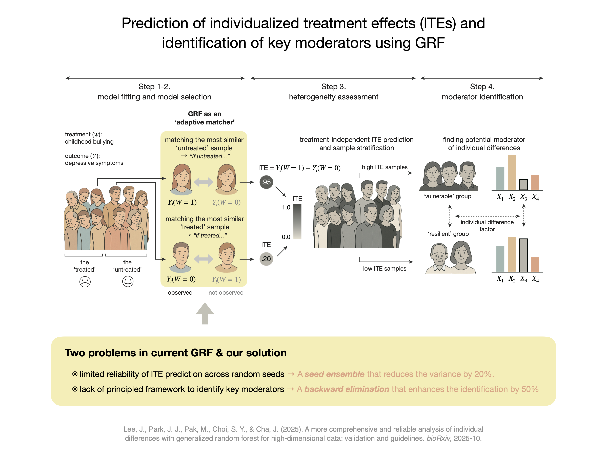

# A more comprehensive and reliable analysis of individual differences with generalized random forest: validation and guidelines      
Jinwoo Lee*, Junghoon Justin Park*, Maria Pak*, Seung Yun Choi*, Jiook Cha†          
*equally contributed; †corresponding author   


- **Contact about Manuscript**: Jiook Cha, PhD (connectome@snu.ac.kr)   
- **Contact about Repository**: Jinwoo Lee, MS (jil527@ucsd.edu)     
- **Preprint:** [https://doi.org/10.1101/2025.10.28.685232](https://doi.org/10.1101/2025.10.28.685232)


<p align="center">
  
</p>


## Abstract
Analyzing individual differences in treatment or exposure effects is a central challenge in psychology and behavioral sciences. Conventional statistical models have focused on average treatment effects, overlooking individual variability, and struggling to identify key moderators. Generalized Random Forest (GRF) can predict individualized treatment effects, but current implementations suffer from two critical limitations: (1) prediction performances vary substantially across random initializations, and (2) identification of key moderator is limited in high-dimensional settings. Here, we introduce two methodological advances to address these issues. First, a seed ensemble strategy stabilizes predictions by aggregating models trained under different random initializations. Second, a backward elimination procedure systematically identifies key moderators from high-dimensional inputs. Simulation analyses across diverse scenarios demonstrate that our approach achieves reliable and valid predictions across random seeds, improved performance in moderator identification, and robust generalization to independent data. To facilitate adoption and interpretation, we provide step-by-step guidance using large-scale neuroimaging dataset (*N* = 8,778) with reusable code. These enhancements make GRF more reliable for modeling individual differences in treatment effects, supporting data-driven hypothesis generation, and identification of responsive subgroups.


## Data Availiability  
The data that support the findings of real-world tutorial analyses in this paper are available from the **Adolescent Brain Cognitive Development (ABCD) Study** via the National Institute of Mental Health Data Archive (NDA; [https://nda.nih.gov/abcd/request-access](https://nda.nih.gov/abcd/request-access)) upon formal application and approval by the ABCD consortium. 


## Scripts 
Our analysis pipeline is organized into two main directories based on the analysis type: `01_simulation` and `02_real-world-tutorial`. The `01_simulation` directory contains simulation and analysis code for both seed ensemble (`01-A_seed-ensemble`) and backward elimination (`01-B_backward-elimination`). The overall tree structure of our working directory is as follows:

```text
.
├── 01_simulation                                               # the lv.1 directory for the Ch. 'Current Limitations and Proposed Suggestions'
│   ├── train-test-simulation.R                                 # simulation script for (lin, weak)/(lin, strong)/(nonlin, weak)/(non, strong) simulation train/test-sets
│   ├── data (not shared)                                       # the lv.1 directory that includes simulated datasets
│   │
│   ├── 01-A_seed-ensemble                                      # the lv.2 directory for the 'Toward more reliable framework' section & Fig 2
│   │   ├── 01-A-1_calibration-comparison.R                     # analysis script for Fig 2a and 2b
│   │   ├── 01-A-2_grid-analysis.R                              # analysis script for Fig 2c
│   │   ├── 01-A-3_ITE-prediction-comparison.R                  # analysis script for Fig 2d
│   │   └── results
│   │       ├── calibration-comparison-results.csv              # Detailed statistics for Fig 2a and 2b
│   │       ├── grid-analysis-results_data_lin_strong.csv       # Detailed statistics for grid analysis with (lin, strong) dataset; see Appendix A
│   │       ├── grid-analysis-results_data_lin_weak.csv         # Detailed statistics for grid analysis with (lin, weak) dataset; see Appendix A
│   │       ├── grid-analysis-results_data_nonlin_strong.csv    # Detailed statistics for grid analysis with (nonlin, strong) dataset; see Appendix A
│   │       └── grid-analysis-results_data_nonlin_weak.csv      # Detailed statistics for grid analysis with (nonlin, weak) dataset; see Fig 2c
│   │
│   └── 01-B_backward-elimination                               # the lv.2 directory for the 'Toward more comprehensive framework' section & Fig 3
│       ├── 01-B-1_linear-ours.R                                # analysis script applying backward elimination for train and test (lin, weak) datasets
│       ├── 01-B-2_nonlinear-ours.R                             # analysis script applying backward elimination for train and test (nonlin, weak) datasets
│       ├── 01-B-3_linear-top10control.R                        # analysis script applying top10% heuristic for train (lin, weak) dataset
│       └── 01-B-4_nonlinear-top10control.R                     # analysis script applying top10% heuristic for train (nonlin, weak) dataset
│
└── 02_real-world-tutorial                                                    # the lv.1 directory for the Ch. 'Tutorial with Real-world Dataset'
    ├── 02-1_data-preprocessing.R                                             # preprocessing script for real ABCD dataset
    ├── 02-2_main-analysis.R                                                  # analysis script for all analyses steps
    ├── 02-3_analysis-for-appendix-B.R                                        # analysis script for descriptive statistics and statistical testings in Appendix B
    └── data (not shared)
        ├── GRF Protocol Release5.1_new.csv                                   # raw ABCD dataset before preprocessing (not shared; contained ABCD dataset)
        ├── GRFProtocol_real-world-dataset_pped-by-JW.csv                     # completely preprocessed ABCD dataset for main analysis (not shared; contained ABCD dataset)
        └── GRFProtocol_real-world-dataset_pped-by-JW_for-appendixB.csv       # partially preprocessed ABCD dataset for Appendix B without normalization (not shared; contained ABCD dataset)
```


## Citation
If you use this repository in your research, please cite the following preprint:

Lee, J., Park, J. J., Pak, M., Choi, S. Y., & Cha, J. (2025). A more comprehensive and reliable analysis of individual differences with generalized random forest for high-dimensional data: validation and guidelines. *bioRxiv*, 2025-10.

```bibtex
@article{Lee2025GRF,
  author    = {Lee, J. and Park, J. J. and Pak, M. and Choi, S. Y. and Cha, J.},
  title     = {A more comprehensive and reliable analysis of individual differences with generalized random forest for high-dimensional data: validation and guidelines},
  journal   = {bioRxiv},
  year      = {2025},
  pages     = {2025-10},
  doi       = {https://doi.org/10.1101/2025.10.28.685232},
  url       = {https://doi.org/10.1101/2025.10.28.685232},
  note      = {Preprint}
}
